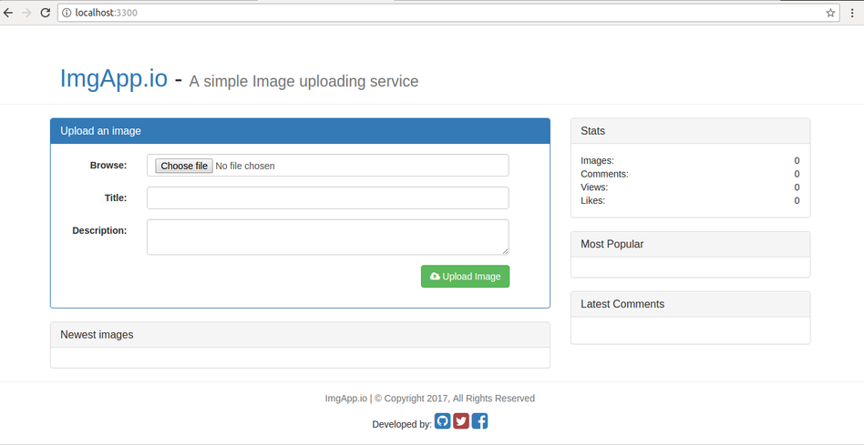

# ImgApp

A simple Image app for uploading images with JavaScript and MongoDB.

## Working example

  Here is a link to [ImgApp](https://node-imgapp.herokuapp.com/)

  

## Prerequisites:

To get started with the app, install 'nodejs'.
You can find the latest version of NodeJS from
[Official website](https://nodejs.org/).
With NodeJS, you also get the latest version of npm

Check both, using following commands:

`node -v`

and

`npm -v`

- Install required modules from npm using:

```bash
npm Install
```

- Make sure that `mongod` is running. Then, you can proceed to next step.

To run the application, from the root of the project, execute following command:

`npm start`

This will launch the server on port 3300. You can visit the app at:
[http://localhost:3300](http://localhost:3300).

## Process to launch to Heroku

- Download Heroku CLI

- Login using:
`heroku login`

- Go to project repo with git, use command:

`heroku create`

This creates a random name for the app. Suppose, the name is 'tranquit-woodland-6534'.

- Rename using following command

`heroku apps:rename node-imgapp --app tranquil-woodland-6434`

- Add remote for heroku
`
`git remote add heroku`

- Create a "Procfile" in the root of the project.

Write following line to launch the project.

`web: node server.js`

- Create a database on [mlab.com](https://mlab.com). Give a new user with username and password and use the link to connect using mongoose.connect function in `server.js` file.

- Once all done, commit using git.
- Push the changes to heroku using:

`git push heroku master`

- At the end, you will get the link to launch your app.
